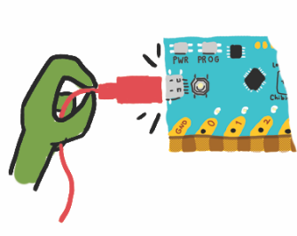
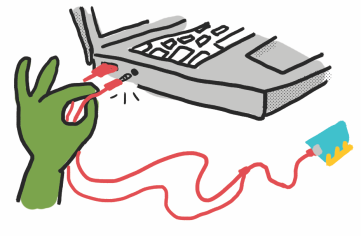
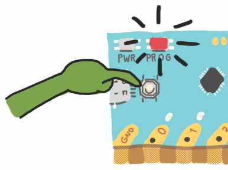

# Upload

Follow these steps carefully to upload the code to your @boardname@.

## Step 1

Plug the cable into your @boardname@.

## Step 2

Plug the USB and audio cables into your programming device. Make sure that the audio cable goes into the headphones plug, not the microphone.

## Step 3

Press and hold the PROG button until the PROG light is steady red.

When done, click the ``||Ready||`` button!

## Troubleshooting

Even if the circuit is done, the Chibi Chip needs to be programmed correctly for our project to work. Sometimes there are problems when we try to send code from our programming device to the Chibi Chip. Here’s how to check if this is an issue!

We test the upload process by trying to upload the Blink example program.  Save any code you’ve written and open up the blink example code by selecting **Examples > Love to Code Vol 1 > Basic Blink**. We start with this known code because it’s easy to tell if it’s working properly. If the upload is successful, we will see pin 0 blink!

If the Basic Blink didn’t upload, let’s check out some possible reasons why:

### 1. Is the volume turned up all the way up? #step1

Is the sound acccidentally muted? Make sure to unmute your sound and turn the volume all the way up so that the Chibi Chip can hear the code. One of the most common upload problems is that the audio is simply too quiet!

### 2. Is the code being converted into sound? #step2

Click the ``||Upload||`` button. Within a few seconds, this orange “sound banner” should appear at the bottom of the screen:

If the sound banner does not appear, the code is not being translated into sound. If this happens, try refreshing the browser. Then, re-open the blink example code, and click ``||Upload||`` again.

### ~hint

On Intern Explorer 11, the editor will generate a sound file (.WAV)
that needs to be downloaded and played with a sound player.

### ~

### 3. Can your browser play web audio? #step3

Try unplugging the audio cable from your programming device for a moment, turning the volume up to its maximum level, and clicking upload. When the sound banner appears, you should hear a staticky sound. This staticky sound is the code that the Chibi Chip is listening for

**If you can’t hear the code playing, try testing to see if your browser is compatible with the Love to Code system.** To run the test, visit  https://ltc.chibitronics.com/test and click on the “Test Audio” button. If you hear a short tune play, that means your browser is compatible. If not, try switching to an up-to-date version of Chrome, Firefox or Edge.

### 4. Is the audio being distorted? #step4

Some laptops automatically apply audio “enhancements” (such as Dolby Audio or bass boost). These enhancements will distort sound in a way that the Chibi Chip may not be able to understand. If you have a Windows computer, particularly those made by Lenovo, try following these instructions to disable pre-loaded audio distortions:

### 5. Do you hear a static sound while programming the Chibi Chip? #step5

That means your audio cable isn’t plugged all the way in. Make sure to push the audio cable all the way into your programming device, so that the Chibi Chip is hearing the code, and not you!

### 6. Is the Chibi Chip in program mode? #step6

Before clicking upload, make sure to press and hold the programming (PROG) button on the Chibi Chip until the PROG LED blinks and stays red. Otherwise the Chibi Chip won’t know to listen for new code.

### 7. Is the Chibi Chip hearing the audio code? #step7

During upload, the red PROG light on the Chibi Chip should blink to show that it hears the code. If the PROG light stays solid red, even though the sound should be playing, it means the audio is not making it to your Chibi Chip. If this is the case, try turning up the volume on your device and check that sounds are playing (Step 3).

### 8. Does the PROG light turn green? #step9

If so, that means the upload is successful. If your project still isn’t behaving as expected, try checking the circuit or the code! 

**If the PROG light just blinks red, but never turns green** that means your Chibi Chip heard some of the sounds, but was not able to hear the entire program. Check again that your volume is turned all the way up ([Step 1](#step1)), and check for hidden add-ons or plug-ins that could be distorting the audio ([Step 4](#step4)). Furthermore, if another kind of device works, this means there is likely some kind of distortion in your programming device’s audio path. 

### 9. Still stumped? #step9

Send us a note at [help@chibitronics.com](mailto:help@chibitronics.com) and we’ll try our best to debug with you!

